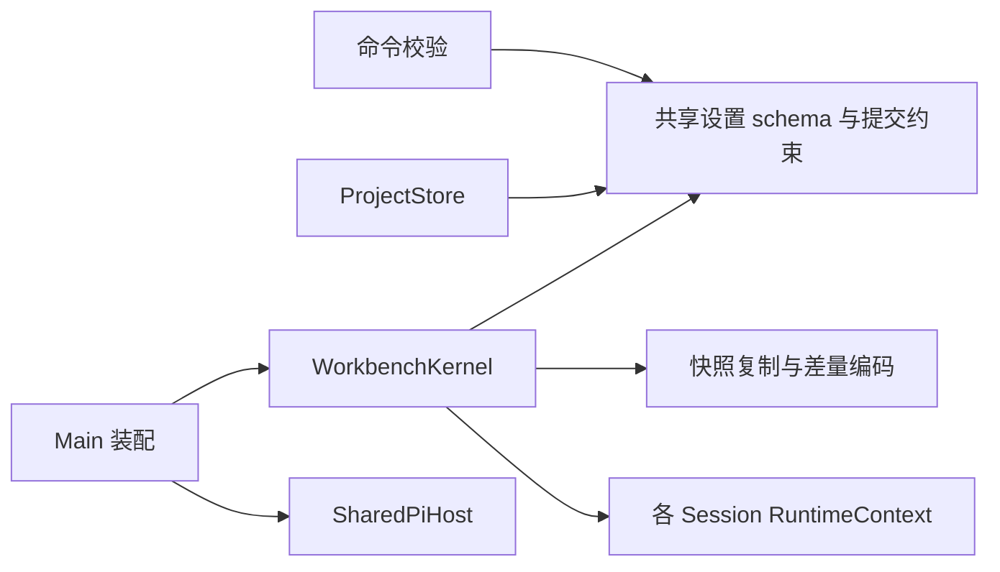
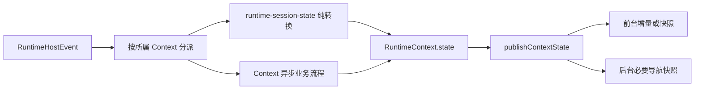

# 架构审查与分轮治理（2026-09-13）

本轮以工作区现有源码为基准，保留此前未提交的开发成果。结论：已出现职责过载的 Kernel，以及过重的 Git 页面控制器；主要问题是局部 owner 承担过多变化原因。静态导入检查未发现循环依赖，也未发现检查范围内的 Renderer → Main、shared → Main、公共组件 → feature 或 feature → composition／其他 feature 的反向依赖。

检查覆盖 `src` 中的 TS/TSX 静态导入、主要入口和热点业务流程，并结合现有决策、迁移代码与测试判断。静态图包含类型导入；不把零入度直接当作死代码，HTML、构建入口、worker 和运行时加载需要另行核对。这不是逐行安全审计，也没有执行桌面视觉或真实远程发布验收。

## 1. 主要发现与优先级

行数使用本轮清理前的快照；行数只定位热点，判断依据是职责、状态所有权和调用关系。

| 优先级 | 模块 | 证据与影响 | 建议边界 |
| --- | --- | --- | --- |
| P1 | `main/kernel/workbench-kernel.ts`，7,808 行 | Runtime 生命周期、前后台事件、预览分页、归档、命名、Ask／Dialog、compaction、图片缓存、设置和状态编码都汇入一个类。`runtime`、`stopRequested`、`provisionalSession`、`pendingSessionName` 等同时存在于 Kernel 活动字段和 `RuntimeContext`，依赖 `captureActiveContextWithState`／`loadContext` 成组同步。前后台分别经过 `handlePiEvent`／`handleInactivePiEvent`，行为修改需要双向核对。已具备上帝模块特征。 | 首先让每个 Context 成为自身执行状态的唯一 owner；Kernel 保留导航选择、跨 Session 协调和发布。状态编码已在本轮移出。 |
| P1 | 已退役 Advisor 控制链 | D-054 已删除产品入口，但 Main、preload、`KernelApi`、命令校验、预览仍提供 5 个控制／配置接口，604 行 WATCHDOG 存储也仍被实例化。退役停在 UI 层。 | 本轮已删除整条遗留控制链；历史 advisory 投影继续保留。 |
| P1 | 设置 schema 分叉 | IPC、Kernel、ProjectStore 各自实现外观、命名、Subagent、General 的校验与复制。IPC 拒绝 `startupWorkspaceRestore=none + autoContinueInterruptedTasks=true`，Kernel 与存储提交却接受，测试还固定了不同结果。 | 本轮由 `shared/workbench-settings.ts` 统一当前 schema、复制和提交约束；历史 schema 的迁移继续留在存储层。 |
| P2 | `features/git/GitChangesPanel.tsx`，2,002 行 | 同时拥有 changes、history、branches、commit、缓存、请求取消和多个 snapshot/token。虽然已有纯模型和展示组件，大量异步控制仍集中在页面。 | 沿 changes／history／branches 三条实际数据生命周期下沉控制逻辑，父组件只保留当前项目、视图选择和必须共享的 mutation gate。不要每个按钮拆一个 hook。 |
| P2 | `main/index.ts`，1,996 行，52 个本地静态依赖 | 高扇出对装配入口本身合理，但这里还包含本地 Host、Windows SSH、WSL、Gateway 管理、安装任务队列、窗口行为与 shutdown 协调的业务实现。 | 先按真实运行模式收拢启动／停止 owner，再减少入口细节。正在开发的远程路径需稳定后再切分，避免引入通用 backend registry。 |
| P2 | `App.tsx`／`Workbench.tsx`，1,421／1,691 行 | App 同时处理 revision 同步、归档预览、分叉、完成通知、设置命令和连接状态；Workbench 又承担布局、导航偏好、快捷键、右栏及大量回调装配。 | 优先下沉归档／分叉到 Session feature；revision barrier 继续由顶层协调。避免新建第二个全局 store。 |
| P2 | `main/git/git-service.ts`，4,335 行 | 仅 2 个本地静态依赖，领域比 Kernel 集中，不宜仅凭体积判定为上帝模块；但进程执行、有界输出、文件指纹、解析、历史读取、提交和分支同步已过于密集。 | 将 Git 子进程与取消／输出预算作为一个完整内部 owner，解析与领域流程再按真实需要分离。保留仓库级串行队列、trust 和 snapshot fence 的统一入口。 |
| P2 | 架构事实与文档脱节 | 架构图仍将 `LinuxLocalRuntime → PiRpcClient → pi --mode rpc` 写为主路径；`main/index.ts` 实际通过 `SharedPiHost.createRuntime` 装配会话。D-012/D-016 等关于不内嵌 AgentSession 的表述与当前实现存在冲突；`LinuxLocalRuntime` 又仍被 `probePiRpc` 使用。 | 先明确 Shared Host 迁移的现行决策与发布验收，再标注 RPC 实现究竟是探针还是受支持执行路径。不能根据旧文档直接删掉其中一条，也不能把实现差异默认为决策已变更。 |

## 2. 已完成的清理

1. 删除 `setAdvisorSystemEnabled`、`setAdvisorExtensionEnabled`、`listAdvisorDefinitions`、`saveAdvisorDefinition`、`removeAdvisorDefinition` 的契约、preload、Main handler、Kernel 控制方法及预览实现；删除对应 WATCHDOG store 和过时控制测试。新增回归验证旧命令被统一校验入口拒绝。独立 Extension source snapshot、历史 advisory projector 与磁盘上的用户配置保持可读。
2. 新增 `shared/workbench-settings.ts`，统一四类设置的 schema 与防御性复制。IPC、Kernel、ProjectStore 的新提交使用同一约束。历史已存储的休眠 auto-continue 偏好可按原值读取，但新的无效组合提交会在持久化和状态发布前失败；新增存储不被修改的回归测试。
3. 新增 `main/kernel/kernel-state-encoding.ts`，整体接管快照复制、entry 复制和增量编码。它只依赖 DTO、共享设置及图片 metadata 工具，不依赖 Kernel 类、Runtime 或 Renderer。Kernel 继续唯一拥有 revision、会话窗口选择和事件发布；没有建立新的状态容器或中转事件总线。
4. 删除 `test:core` 中退役 Advisor store 的测试 glob，并去重已有的 Desktop Client 测试 glob。

按本轮验证快照计算，相关生产源码净减少 **1,141 行**，已计入两个新 owner 文件；不把删除测试或其他任务的同期修改算作收益。Kernel 从 **7,808 → 7,228 行**。它仍然过重，不能把这次提取描述为已经解决了全部上帝模块问题。

前端公共组件、样式和布局规则未因本轮清理发生变化，frontend skill 无需同步。

## 3. 保留的必要设计

- **Web 与 Desktop Gateway**：两者共享 Kernel，但浏览器的 Origin／Cookie／可信代理与 Desktop 的 loopback／SSH／Bearer／controller 边界不同。不能合并为参数开关很多的万能网关。
- **ProjectStore 历史迁移**：v1–v16 的兼容逻辑有持久化数据与回归测试支撑。当前 schema 已统一，旧版迁移并非可随意删除的冗余。
- **Capability Inventory**：service 当前没有生产调用方，但 worker 是明确的构建入口，开发计划 P3-5 明确保留待接 Settings 的能力。因此它是暂停功能的维护成本，不是本轮可以直接判定的死代码。后续恢复时应完成接线；若取消 P3-5，再成组移除 service／worker／contract／构建入口。
- **Revision barrier、身份 fence、有界缓存**：这些分别处理异步提交确认、旧请求污染和内存边界。名称相近、检查重复出现不代表它们可以删掉；真正应统一的是同一业务规则，而不是消除每一次边界检查。
- **历史 Advisor 卡片**：UI 控制退役不等于历史 Session 数据退役。投影逻辑继续承担只读兼容。

## 4. 后续实施顺序与验收

| 顺序 | 范围 | 必须保持的不变量与验收 |
| --- | --- | --- |
| 1 | Kernel Context 单一状态所有权 | 同一 Session 的执行状态只写入它自己的 Context；前后台对同一事件序列产生等价的 Session 结果；切换、首条 prompt materialization、compaction、Ask／Dialog、命名和 hibernation 的旧请求不能污染当前 identity。删除活动字段镜像后再谈进一步拆文件。 |
| 2 | Git 页面控制逻辑 | changes／history／branches 各自拥有查询状态、请求取消和错误；项目与仓库 snapshot fence、mutation gate 仍只有一个入口；重复点击、切换项目、stale 返回和部分成功有行为测试。 |
| 3 | Main 运行模式装配 | Linux Host、Windows SSH Client、WSL Client 各自拥有成对启动／停止；退出顺序可验证，异常清理不丢 owner，不新增第二 Kernel，不复制校验和 dispatch。 |
| 4 | GitService 内部执行边界 | 所有 Git 子进程使用同一取消、超时、输出预算和错误收口；保留 exact repository／index／HEAD／upstream fencing。先恢复相关既有失败用例，再迁移，不能用抽象遮盖失败。 |

每一步按业务流程迁移，删除原路径后收口；不并存兼容 wrapper，不预建 registry、基类、微型 service 或第二状态系统。

## 5. 验证记录

验证日志与源码指纹位于本机 `/tmp/pi-gui-architecture-20260913/`。此目录为临时证据，不是发行产物。

- 清理前相关基线：318 项通过；清理后定向测试：321 项通过，含设置严格校验、历史读取兼容、旧 Advisor 命令拒绝，以及现有会话、投影、分页和差量回归。
- 状态编码模块的 14 个函数逐一与清理前源码比对，除导出声明外实现完全一致；重新扫描当前静态导入图，仍未发现循环或上述分层违规。
- 类型检查通过，Desktop/Main/preload/Web 生产构建通过；Vite 仍有大 chunk 提示。运行 Node 26.4.0，使用与当前 `pnpm-lock.yaml` 完全相同的现有 Linux 依赖。
- 完整 `test:core` 首次运行：1,226 项，1,187 通过、36 失败、3 跳过，**未全绿**。其中 14 个 Inventory 顶层失败来自默认真实 Pi package 路径不存在；使用用例已有的 `PI_GUI_TEST_PI_PACKAGE_ROOT` 指向本机同版本 Pi 0.83.0 后，该文件的 80 项测试全部通过，记录于 `test-inventory-env.log`。这是独立补验，不是一次新的全库全绿结果。
- 从清理前保存的源码独立复跑其余 22 个失败用例，16 项 Git、4 项休眠 provider、1 项休眠命令、1 项 Task Composer 源码断言全部复现同样失败，记录于 `test-baseline-failures.log`。本轮已定位完整运行的失败来源，但既有失败仍须跟进；不以定向通过或环境补验替代全库通过。
- 主工作区同时有其他开发写入远程连接、preload 和 Composer 文件。`validation-manifest.json` 固定了本轮构建与全库测试所对应的源码指纹；不将其他任务之后的改动宣称为已经受本轮完整验证。
- `git diff --check` 通过。未启动桌面、未更改运行中的服务、未提交 Git commit。

## 6. 第二轮：Context 执行字段单一所有权

本轮只迁移 Kernel 的会话执行字段、补充行为回归，并更新本文与架构说明。其他任务正在修改的 Main、远程连接、preload、Renderer 与构建脚本保持原样。

### 已完成

- 删除 Kernel 中 8 个可写镜像：`runtime`、`unsubscribeRuntime`、`launchCommitting`、`provisionalSession`、`provisionalCommit`、`provisionalSettled`、`pendingSessionName`、`sessionNameOperation`。Runtime 只从活动 Context 推导，其余字段由所属 Context 持有；状态发布与会话切换不再覆盖它们。
- 将 Kernel 全局停止标记明确为 `stopAllRequested`，与单个 Context 的 `stopRequested` 分离。切换或清空活动投影不再重置全局停止门禁。
- 前后台统一经过 `beginContextProvisionalCommit`、`ensureContextSessionNameGenerationQueued` 和 `beginContextSessionNameGeneration`；删除 7 个重复入口或已无必要的辅助方法，没有引入兼容 wrapper、服务容器或新文件。
- 延迟 prompt 确认捕获原 Context，返回后先检查所有权与停止状态，再安排原会话的自动命名。

本轮 Kernel 从 **7,228 → 7,038 行**，生产代码净减少 **190 行**。字段减少解决的是具体所有权问题；活动 `KernelState` 与 Context 展示投影、项目导航集合的同步仍然存在，前后台事件处理也尚未整体统一，因此顺序 1 仍有后续工作，不能宣称 Kernel 已完成解耦。

### 修复的行为问题

1. **前台会话首次落盘可能漏掉重试。** `message_end` 发起 provisional 提交后，如果 Host 的 `activity-settled` 先到、校验随后返回 `ENOENT`，旧前台路径只修改 Kernel 镜像，提交任务读到的 Context 标记仍为 false。没有后续事件时，会话会持续停留在 provisional。现统一读写 Context settled 标记，在原提交槽释放后重试，并只持久化一次；后台同时执行同一回归。
2. **等待首条 prompt 确认时切换会话，原会话漏掉自动命名。** 旧确认回调查询当前活动镜像，导致原会话不再进入命名流程。现使用请求发起时的 Context，生成名称不会写入新前台会话；停止后迟到的确认也不会重新启动命名。

### 验证与边界

证据位于本机 `/tmp/pi-gui-context-ownership-20260913/`，隔离快照及 `validation-manifest.json` 固定了验证输入。

- 修改前 Kernel 基线 **233 项通过**；新增 4 个行为用例。将同一测试文件放到旧 Kernel 实现上独立复跑，两个上述缺陷分别失败、两个对照通过，见 `regressions-before.log`；新实现全部通过。
- Kernel、投影、ProjectStore、会话文件读写、SharedPiHost、命名生成器及设置相关测试合计 **405 项通过**，其中 WorkbenchKernel **237 项通过**；工作区和同锁文件 Linux 依赖的隔离快照结果一致，见 `test-context.log` 与 `test-context-isolated.log`。
- 类型检查通过；隔离快照的 Main、preload、Renderer、Web 生产构建及 build identity 生成通过，见 `typecheck-final.log` 与 `build.log`。Vite 的大 chunk 提示仍存在。
- 静态复查已无上述可写活动字段、前后台提交／命名旧入口或执行字段 capture/load 双向复制；`git diff --check` 通过。
- 本轮没有重跑完整 `test:core`，第一轮记录的全库失败不能视为已修复；没有执行真实桌面或远程发布验收，也未提交 Git commit。

下一步继续顺序 1：让 Session 的状态转换统一作用于所属 Context，发布层再决定更新前台 Conversation 还是后台导航；保留共享设置、revision 和项目导航的协调职责。先覆盖同一事件序列的前后台等价行为，再消除余下投影同步，之后才评估是否需要拆文件。

## 7. 第三轮：统一会话事件与发布边界

### 方案与执行范围

本轮完成三个连续步骤：先将 Context 从完整工作区快照收窄为会话状态，再统一前后台事件处理，最后统一会话状态的发布。实现只涉及 Kernel、一个新纯状态模块、Kernel 回归测试与架构文档；保留并行开发的 Main、远程连接、Renderer、部署与构建脚本。

- **会话状态边界**：`RuntimeSessionState` 仅含 `activeSessionKey`、`commands`、`advisor`、`availableModels`、`extensionDialog`、`runtime`、`session`、`conversation`。启动与 capture 不再把完整 `KernelState` 复制到 Context；重新激活采用当前工作区设置，不能从后台 Context 恢复陈旧设置或导航。实测 Context 状态字段从 **19 → 8**。
- **纯状态转换**：`runtime-session-state.ts` 整体拥有 Runtime／Pi 同步事件投影、运行开始／结束转换及必要的 Session 投影工具。它不依赖 Kernel 类、不拥有状态容器，也不执行 IO。Kernel 保留命名、持久化、交互响应、compaction 等完整异步流程及身份校验。
- **统一事件路径**：删除 `handleRuntimeEvent`／`handlePiEvent` 与全部 `handleInactive*` 分叉，前后台统一按 Context 处理消息、工具、队列、运行生命周期、Session 名称与 Host 诊断／退出事件。事件处理阶段不切换活动工作区。
- **统一发布**：`publishContextState` 接管会话变更的发布，覆盖普通事件、命名、usage、Ask／Dialog、compaction、prompt 和命令回显；前台按原增量／快照约束发送，后台只比较必要的项目导航。删除重复的对话框发布、活动会话 activity 维护、单次回显转发，以及已无必要的通用 transition 和 capture-with-state 辅助方法。命令／导航装配仍保留 `captureActiveContext`；这里缓存的是限定的会话投影，没有新增全局 store、事件总线或可选后端 registry。
- **失败回调归属**：修复发送 prompt 后切走、随后收到拒绝时原会话永久停在 running 的问题。持久会话与 provisional 会话都会恢复原 Context 的 ready／settled 状态，并发布所属导航变化；当前会话的内容与状态不受影响。

Kernel 从 **7,038 → 6,364 行**，减少 674 行；新纯状态模块 181 行，**本轮生产源码净减少 493 行**。共删除 21 个旧类方法，由统一分派和发布方法接管实际业务，不保留兼容转发。Kernel 仍负责归档、预览、图片读取、Runtime 回收与启动等业务，因此不能把本轮结果称为所有架构热点均已解决；本轮划定的会话事件与发布迁移已经完成。

### 验证

证据、源码快照和指纹位于本机 `/tmp/pi-gui-session-events-20260913/`。

- Kernel 相关测试 **321 项通过**，其中 WorkbenchKernel **241 项**。新增 5 项行为测试：同项目／跨项目的前后台完整事件序列等价，持久／provisional prompt 延迟失败，以及 Context 字段范围与重新激活后设置保持最新。删除了向 Context 中已移除的 `activeProjectKey` 镜像注入错误的旧子用例，真实 Project owner、Session file／ID 错配回归继续保留。
- 将两个延迟失败用例放到本轮修改前的 Kernel 上复跑，两者均停在 running；新实现均恢复 ready，见 `regressions-before.log`。既有后台 reentrancy、连续流式事件无发布／无导航扫描、compaction 终结、fork、回收、命名与持久化竞态测试继续通过。
- **完整 `test:core`：1,297 项，1,277 通过、17 失败、3 跳过，未全绿。** 使用同锁文件的 Linux 依赖及已有 `PI_GUI_TEST_PI_PACKAGE_ROOT` 真实 Pi 路径。17 项集中于 Git 分支同步（15）、休眠命令过滤（1）、Task Composer 源码断言（1）；这些模块的生产实现未被本轮修改。失败来源的旧 Kernel 精确复跑记录见 `existing-failures-exact-baseline.log`，不把它们列为本轮已修复。
- 类型检查及 Main／preload／Renderer／Web 生产构建通过，见 `typecheck-isolated-final.log`、`build-final.log`。一个测试 fixture 的只读 tuple 标注改为已有可写 registry tuple；`type-fixture-validation.json` 验证其运行表达式未改变，完整测试的行为结果仍适用。构建重新生成了最终源码对应的 build identity。
- 197 个生产 TS/TSX 文件、604 条静态本地依赖边中未发现循环；新状态模块仅依赖 DTO、Runtime／Pi 事件类型、prompt 规范化与 Conversation projector。此检查包含类型导入，不覆盖动态加载。
- 同一 **2,000 条 message_update** 序列，前后台各重复 5 次：重构前后前台均为 **2,000 个增量、0 个全量快照、517,870 字节**；后台均为 **0 发布、0 字节、0 导航扫描**。两者均不额外读取 Host state。中位耗时记录在 `benchmark-summary.json`，只作为本机合成负载观察，不宣称真实桌面延迟改善。
- `validation-manifest.json` 固定了验证输入；并行任务在快照之后的修改不在本轮构建结论内。未做真实桌面／远程发布验收，未提交 Git commit。

## 8. 第四轮：恢复测试基线与 Git 面板职责收敛

本轮继续限定在已识别的问题上，暂缓进一步拆分 Kernel。开始执行时，工作区已包含 Git 2.43 兼容修复；先验证并保留该实现，再修正旧断言和迁移 Renderer 流程。

### 实施结果

- **Git 工具链**：确认当前 `GitService` 已将 `--start-after` 分页替换为有上限的 ref 前缀扫描；符号引用计入扫描预算，超限明确标为 truncated。原有 15 项分支同步失败不再出现，Git Service 的 66 项测试全部通过。没有为已消除的版本依赖另加启动探针、第二套执行分支或静默降级。
- **旧断言**：休眠命令目录测试改用当前真实适配且 provenance 合法的 `todos` Extension 作为可见命令对照；Task Composer 断言同时保留 Host path capability 与非 Task 条件。未恢复退役 Advisor 控制面，也未放宽 Composer 的能力门禁。
- **Git 状态归属**：`use-git-repository.ts` 唯一发布仓库状态并拥有刷新／授权／Project 生命周期；其他流程只读 generation／repository 引用，使用窄方法刷新或发布结果。完整的变更与提交、历史阅读、分支同步分别进入 `use-git-changes.ts`、`use-git-history.ts`、`use-git-branches.ts`。
- **清理重复协调**：以 Project key 重建内部面板，删除分散于父组件的各流程 token／snapshot／dialog 重置，以及 `stateProjectKey`、`initialErrorProjectKey` 两套展示归属镜像。各流程管理自己的取消和缓存；历史响应在完成时直接核对当前 HEAD／branch，不能等待 React effect 才阻止旧结果。
- **保留业务约束**：Main 的仓库级写入串行队列、trust 与 snapshot fence 不变；Renderer 保留 diff single-flight、有界 LRU、重复暂存门禁、部分提交成功与确认框 identity。现有 UI、样式、键盘 Tab 与 modal 语义继续复用，没有新增全局 store、事件总线或共享组件抽象。
- **集成修复**：全库检查发现同期 `resolveInstalledWslLauncher` 缺少函数闭合括号，仅补上这一个语法符号；其他 WSL 开发内容保留。

`GitChangesPanel.tsx` 从 **2,002 → 572 行**；四个职责模块分别为 **162／620／473／192 行**。计入新增模块和复用的 mutation key 函数，Git 生产源码合计净增加 **22 行**；收益是移除跨域状态协调、明确所有权，不将文件搬移包装为总体代码量下降。

### 验证方式

新增 `git-workflow-lifecycle.test.ts` 与独立 browser fixture，使用真实 React／ReactDOM 和临时 Chromium profile；Pi Git bridge 为可控延迟的测试替身，不触及用户仓库，也不需要新增依赖。设置 `PI_GUI_TEST_BROWSER` 为本地 Chromium 可执行文件即可启用；未配置时该项明确跳过。

一次执行覆盖 8 个行为场景：Strict Mode 与过期初始化刷新；历史分页去重；HEAD 变化后的旧详情；diff 请求合并、缓存与刷新失效；重复暂存及切换后的延迟写回；commit 成功但 push 失败与重复提交阻止；分支确认的原 Project 归属；真实 Git 面板切换后的 Tab 和历史清理。现有 SSR／交互 contract 回归同时保留，并新增功能模块依赖方向检查。

验证输入及日志位于本机 `/tmp/pi-gui-git-ownership-20260913/`。`before-manifest.json`、`validation-manifest.json` 分别固定开始时和最终验证的源码指纹；`structure-verification.json` 记录生产模块静态依赖与行数。

最终验证：

- `node --run test:core`（与 package script 相同入口，使用 Node 26.4.0 和同锁文件 Linux 依赖）：**1,305 项，1,302 通过、0 失败、3 项 Windows 专属测试跳过**。本轮新增的 Chromium 回归已在该次完整执行中启用，8 个行为场景全部通过；见 `test-core-final.log`。Git Service 的独立 66 项基线见 `git-baseline.log`。
- 全库类型检查通过，见 `typecheck-final.log`。第一次完整核心运行还遇到同期远程设置测试的旧预期；将工作区已经更新的测试纳入最终快照后重跑完整套件通过，保留 `test-core-first.log` 供追溯。
- Main／preload／Renderer／Web 生产构建通过，最终源码对应日志为 `build-final.log`；Vite 的大 chunk 提示仍保留。未启动用户桌面会话，未执行真实 Windows／WSL／SSH 发布验收。
- 新模块与现有模块静态导入未发现循环；布局、样式和公共 UI 组件没有本轮修改。前端 skill 内容仍适用，无需改动。
- 本轮所拥有源码的指纹与验证快照一致；同期其他任务后续更改不自动继承本轮结论。没有提交 Git commit。

本轮范围已经收口。后续优先按真实功能验收发现的问题修复，暂缓继续扩大 Kernel 或 Git Service 的结构重构。

## 9. 第五轮：Git 同项目异步顺序与确认快照

继续复核上一轮拆分后的真实行为，本轮未扩大结构重构，只修复两个可复现的状态归属问题。

1. **较早的刷新覆盖写入结果**：用户在 idle commit 确认框中发起提交前，可能已经有一次全局刷新在途。提交回包发布新仓库快照后，旧刷新仍持有有效 token，晚到时会把界面恢复为旧 HEAD／index；授权成功后也有同类问题。修复放在唯一 `replaceDisplayedState` 入口：每次发布快照统一作废之前的刷新 token 并结束旧 loading，使其成功、错误和 finally 回调全部失效。此后发起的新刷新照常执行，没有新增 RPC、轮询或写操作重试。
2. **分支确认借用了列表的可变快照**：全局刷新期间仍可打开 idle 分支确认框；刷新完成会重新准备分支列表。原实现提交时读取 `branchSnapshotRef.current`，可能把用户已确认的旧 snapshot 替换成新列表 snapshot。确认框现在与 commit 一样保存打开时的 snapshot，列表 owner 继续独立刷新；执行按该确认快照交给 Main 原有校验入口处理。DTO 留在 feature 控制层，没有进入纯 UI model／component。

### 回归证据

- `refresh-before.log`：新增场景在本轮修改前明确失败于“旧刷新覆盖提交后的仓库状态”。
- `confirmation-before.log`：仅应用刷新修复后，确认场景仍明确失败于“提交改用了用户未确认的新 snapshot”。
- `browser-fixed.log`：真实 React／ReactDOM 与独立 Chromium profile 的 **11 个场景通过**，新增覆盖提交后旧刷新晚到、分支列表刷新期间的确认快照、授权后旧状态／错误晚到，并验证之后的新刷新仍可成功。Pi Git bridge 为受控延迟的测试替身，不涉及用户仓库写入。
- 生产源码仅修改 `use-git-repository.ts` 与 `use-git-branches.ts`，测试复用已有 lifecycle runner／fixture；没有新增模块、依赖或共享状态容器。`architecture.md` 同步了发布与确认规则；前端 skill 无需修改。

快照、指纹及日志位于 `/tmp/pi-gui-git-ordering-20260913/`。`before/` 保留本轮开始源码，`validation/` 只在该基线上覆盖本轮拥有的文件，避免把同期其他开发的中间状态混入回归。

最终验证：

- 完整核心测试 **1,306 项，1,302 通过、0 失败、4 跳过**，见 `test-core.log`。其中构建时序导致跳过的真实 Pi worker 用例，在生产构建后单独补验通过，见 `test-built-worker.log`；剩余三项是 Windows 字体、Credential Manager 和 npm shim 验证。
- **11 个浏览器行为场景通过**，并已包含在上述完整核心测试中；全库类型检查和 Main／preload／Renderer／Web 生产构建通过，见 `typecheck-final.log` 与 `build.log`。Vite 原有的大 chunk 提示仍存在。
- 本轮四个源码／测试文件与最终快照指纹一致。工作区之后的两处 Desktop Client CSS 改动不在本轮验证输入中，未改写或回滚。
- `git diff --check` 通过。没有修改 Kernel、Git Service、UI 布局或公共组件，没有提交 commit；浏览器回归不等同于真实 Windows／WSL／SSH 发布验收。

## 10. 第六轮：对齐 Shared Host 架构与前端会话流程

本轮执行用户确认的两项收口：运行架构事实对齐，以及前端归档／预览／分叉的完整流程归属。全量回归另暴露了既有的时钟敏感测试与 Git stdin 错误诊断丢失，已做最小修复，见下文；Kernel 生产实现、Main 装配和真实 WSL／SSH 环境未修改。

### 实施结果

- `architecture.md` 改为当前 `SharedPiHost → SharedPiAgentSession` 主路径，补充 Shared 环境 owner、逻辑隔离与共享进程故障域、无独立 RPC PID，以及当前 RuntimeHost 的 inventory／quiescence／lease 接口。D-078 显式替代相关旧 RPC 主路径假设；外部 RPC 探针、metadata 命名与 Provider 测试仍按实际调用保留。历史 ADR 不重写，RPC smoke 与 SDK 会话验收也不互相替代。
- `use-session-archive.ts` 一起拥有归档凭证、过期、撤销、临时预览与只读分页。凭证在提交前同步占用，避免同一 React render 内重复点击；独立凭证仍可并行处理。导航清理立即作废此前的预览请求，晚到响应不再清空新选择或覆盖新会话；分页继续复用已有完整 preview identity 与窗口边界校验。
- `use-session-fork.ts` 拥有候选、弹窗、错误、提交与请求失效。打开时绑定 Project／Session／Session ID，历史会话先经过既有 controller 激活，旧候选不得用于新目标。提交复用 `App.runActionResult` 的同步互斥与 revision acknowledgement；成功回填草稿、取消和失败反馈仍归原业务语义。自己的成功 fork 会改变 canonical identity，不能在 ack 到达前误判为外部切换并丢失草稿。
- `App` 保留 revision barrier、跨 feature 操作互斥／错误归属、导航和 Composer 草稿装配；Workbench、纯展示组件、公共 UI 与 CSS 未修改。选择意图类型移到 renderer shared 的 `session-view-target.ts`，避免 Session feature 反向依赖 composition，也不保留兼容 re-export。
- `App.tsx` 从本轮开始的 **1,456 → 1,212 行**。两个 hooks 分别 159／158 行；计入类型迁移后前端生产源码净增加 **76 行**，用于明确流程归属和补齐请求保护，不将文件拆分描述为整体删代码收益。没有新增依赖、store、registry 或 IPC contract。
- 前端规范补充 Session owner 边界。frontend skill 的依赖方向、公共组件与验证规则仍准确，无需修改 SKILL.md。

### 行为证据与验证

- 复用真实 React／Chromium 的测试启动器，Git 与 Session suites 共用 `test-support/run-browser-checks.ts`。只把实际重复的浏览器启动／CDP／清理移动到测试辅助代码；不启动桌面、不访问用户仓库或真实模型。清理 temporary profile 使用有限次数的文件系统重试，应对 Chromium 子进程尾部写入。
- Session 的 **12 个浏览器场景**覆盖 StrictMode 开关与卸载、历史会话激活、旧目标提交、重复分叉、ack 前后草稿、取消／失败、归档等待与凭证发布、一次性凭证并发、导航后晚到预览、最新请求／过期、只读分页，以及完整 App 弹窗与 Composer 装配。Git 原有 **11 个浏览器场景**继续通过。
- `test-session-before.log`：仅把验证目录的 App 换回本轮修改前源码，同一真实 App 导航场景明确失败于 `Late archive preview replaced a new Session selected through the real App`；随后恢复当前源码。`test-session-app-final.log` 中 12 项场景通过，包含真实 App 的 revision barrier 与预览 bridge，不把测试替身描述为真实 Pi 运行验收。
- 类型检查与 Desktop/Main/preload/Web 生产构建通过；Vite 保留原有大 chunk 提示。静态检查覆盖生产 TS/TSX 的字面量相对导入，排除测试／fixture／test-support／声明文件，**206 个节点、649 条边，无循环或所检查的分层反向依赖**。

全量回归带出的两项收尾：

- 首次全量 `test-core.log` 为 **1,308 项，1,302 通过、3 失败、3 跳过**。其中两个前后台等价测试在相同事件的 `durationMs` 上相差 1–数毫秒：测试仅固定了 Kernel 注入时钟，projector 仍读取真实 `Date.now()`。现在测试的两条执行轨迹使用同一随事件推进的时钟，继续比较完整 Session state；未改变生产计时或删去 duration/timestamp 断言。
- Git 的既有 post-discovery 错误测试偶发退化为 `Git service failed.`。原实现只对 `EPIPE` 等待 stderr/close，其他 stdin 写入／结束失败会提前杀掉进程并丢失具体诊断。`runHashChildren` 现在由两个实际输入 I/O 入口标记失败并统一等待有界退出，不依赖错误码猜测；原 timeout、abort、输出预算和非输入错误的立即停止保持原样。新增测试只对独特 fixture 内容注入 `ERR_STREAM_DESTROYED`，Git 子进程与延迟 stderr 为真实执行；`test-git-input-before.log` 在修改前实现稳定失败于相同的笼统错误，修改后与原失败场景及两个时钟测试共 4 项通过。没有为测试添加生产依赖注入或拆分 Git Service。

本轮快照、源码指纹、定向与全库日志位于 `/tmp/pi-gui-session-flows-20260913/`。校验在当前源码快照的独立 Linux 目录进行，使用相同锁文件的已有依赖；没有修改共享工作区的平台依赖，也没有提交 commit。真实 Windows 原生交互、完整 prompt/tool 和 P4-3 SSH 发布 gate 仍按既有计划保留开放。

最终验证：

- `test-core-final.log`：**1,309 项，1,306 通过、0 失败、3 跳过**，包括 12 项 Session 与 11 项 Git 浏览器场景、真实 built worker、新增 Git stdin 诊断回归及固定时钟后的前后台等价比较。跳过项为 Windows 字体、Credential Manager 与 npm shim。
- `typecheck-final.log` 和 `build-final.log`：全库类型检查及 Main／preload／Renderer／Web 生产构建通过；源码与产物摘要见 `final-verification.json`。构建在最终测试前完成，不以补验替代这一次完整通过结果。
- 最后核对本轮所有生产源码／测试文件与验证快照一致；本轮开始后无其他源码漂移，既有 dirty 工作保留。`git diff --check` 通过；不新增性能提升结论，不宣称真实 Windows／WSL／SSH 发布验收完成，没有提交 Git commit。

本轮结束后暂停大范围结构拆分，转入既有真实运行验收与使用反馈；Kernel 和 Git Service 的进一步拆分仍按具体职责与实际问题判断。

## 11. 第七轮：Windows 原生检查与真实 SDK 会话回归

2026-09-14 继续用户已授权的收口验证。本轮没有发现需要扩大结构重构的生产问题，重点补齐平台测试入口和 Shared Host 的实际执行证据。

- **平台测试入口**：`test:platform` 原先遗漏 `pi-executable.test.ts`，使 Windows npm shim 用例在 Linux 核心回归中跳过、在 Windows 平台入口中也不执行。本轮将该文件纳入现有入口，不增加另一套测试脚本。Credential Manager 用例改为每次唯一的测试 target，并在 test teardown 中清除，避免并发测试互相覆盖或断言失败后留下凭据。
- **真实 SDK 会话**：新增一个连贯的集成用例 `src/main/runtime/shared-pi-prompt.test.ts`，直接使用生产 `SharedPiHost`，由 Pi SDK 自行生成请求、解析分片 SSE、执行内置 read、写入 JSONL、分叉并恢复。只有模型端点是本地 HTTP fixture；两个临时项目提供同名但内容不同的文件，两个初始请求都到达后才响应，确保真的存在重叠执行。未访问用户项目、Pi 配置或模型账户。
- **行为断言**：逐会话核对 agent 起止、工具结果、消息角色与最后回复；分叉后核对新身份及原文件内容不变。销毁整个 Host 后，从文件同时恢复原会话、分叉会话和另一项目会话，比较完整 JSON 历史与身份，再向恢复后的分叉发送 prompt，核对其他两条历史不变。4 次 prompt 共 8 次 HTTP 请求、4 次 read，没有额外模型轮次或重试。JSONL 会省略值为 undefined 的可选属性，历史比较按完整 JSON 内容进行，不删减时间戳或实际字段。
- **测试启动归属**：日志暴露了 12 处重复 SSR Vite 启动配置：部分关闭依赖扫描，部分仍扫描整个工作区；`hmr: false` 也不能禁止 middleware mode 下独立的默认 WebSocket 端口。现统一到 `create-ssr-test-server.ts`，由一个入口拥有 SSR 的无浏览器扫描、无监听配置及关闭清理。浏览器启动器单独保留真实 HTTP / Chromium，将依赖扫描限定为当前 fixture 并显式关闭无用 WebSocket。12 个 SSR 调用方只替换启动样板，行为断言保持原样。定向 101 项全部通过，其中包含 23 个浏览器场景；端口冲突与扫描错误均消失。原始日志保留为 `test-core-before-browser-cleanup.log` 和 `test-core-before-ssr-cleanup.log`，未靠压制日志掩盖问题。
- **验证边界**：Windows 字体、Credential Manager 和 npm shim 已在原生 Windows Node 26.4.0 实际执行；SDK 用例在 WSL/Linux Node 26.4.0 执行。SDK 回归不涵盖 Windows Renderer、WSL transport 与 Kernel 的整条产品路径，不能关闭 P4-4 的完整 prompt/tool 或人工通知、文件对话框、导出验收。用户暂缓的 P4-3 SSH gate 继续保留。

快照、源码指纹和日志位于 `/tmp/pi-gui-runtime-acceptance-20260914/`。Windows 测试直接按当前 package script 的完整参数列表调用锁定版本的原生 Node；Linux 使用独立源码快照及同锁文件的依赖。此前 PowerShell 调用未取得有效测试输出，不计为通过证据；最终 Windows 结论以原生 Node 生成的 `test-windows-native.log` 与 `windows-result.json` 为准。

最终验证：

- `test-core-final.log`：**1,310 项，1,307 通过、0 失败、3 项 Windows 专属测试跳过**。真实 built worker、新增 SDK prompt 回归以及已有 Chromium 流程回归均在此次完整执行中启用；三个 Windows 跳过项均由本轮原生 Windows 执行覆盖。
- `test-windows-native.log`：**66 项，61 通过、0 失败、5 项 Linux 条件跳过**；跳过的是 Linux dev/部署 fixture、两个真实 Host 文件权限用例和 Unix 执行权限用例，它们均在 Linux 核心套件中执行。
- `typecheck-final.log`、`build-final.log`：全库类型检查与 Main/preload/Renderer/Web 生产构建通过，保留现有 Vite 大 chunk 提示。最终源码与产物摘要、工作区核对结果见 `final-verification.json`。
- 本轮共修改 20 个文件，只涉及测试、平台测试入口和验证记录；生产模块和依赖未改动。验证源码与工作区一致，其他既有 dirty 修改保留；`git diff --check` 通过，没有提交 commit。前端改动限定在测试启动器及其 SSR 调用方，布局、组件、交互规范和 skill 无需修改。继续以具体运行问题决定优化，不增加新的框架或拆分任务。

## 12. 第八轮：真实 Windows/WSL 模型链路与代理修复

用户同意推进实际验收后，在隔离目录启动了原生 Windows Node 驱动、生产 WSL 管道和实际 Linux Electron Main/Kernel/Shared SDK。默认 `grok-4.6` 及同端点另一个模型最初都请求超时；对照连接确认环境代理可用，但嵌入式 SDK 没有执行 Pi CLI 的网络初始化。

生产修复仅在既有 `SharedPiProcessEnvironment` 增加进程代理的创建与恢复：首次 Host 按环境变量配置 Node 内置 HTTP(S)/fetch 代理，复用已有 owner 计数，最后一个 Host 释放时恢复。初始化在 Session 环境覆盖前完成，并传递快照；网络配置不随 Session 创建、分叉或停止反复改变。使用公开 `node:http.setGlobalProxyFromEnv`，已核实锁定 Electron 43.1.1 内含 Node 24.18.0 并支持该接口；没有复制 Pi 私有 HTTP 实现或新增依赖。API 语义见 [Node 官方文档](https://nodejs.org/api/http.html#httpsetglobalproxyfromenvproxyenv)。

- **回归证据**：原 SDK 并发/工具/分叉/重启回归改用不可直接解析的 `.invalid` 模型域名，经本地 CONNECT 代理返回 gzip SSE；同时验证本地地址按 `NO_PROXY` 直连。修复前明确失败，修复后 Linux 和 Windows 均通过。补充多个 Host 的 HTTP agent 共享及最后释放恢复断言。
- **真实模型证据**：修复后 `grok-4.6` 通过 11 个检查点，包含实际 Linux read/write/bash、Windows 中文空格附件路径读取、HTML 文件内容、分叉身份、归档撤销、独立归档预览、长工具中止及运行中拒绝重启、关闭后恢复两条会话并继续对话。原工具期限过后无迟到输出。第一次脚本将同一归档凭证用于预览后再撤销，按产品规则被拒绝；脚本修正为独立路径，未改动产品凭证语义，失败记录保留。
- **最终验证**：核心 1,310 项，1,307 通过、3 项 Windows 条件跳过、0 失败；本轮 Windows 代理/SDK 回归 3/3；全库类型检查和 Main/preload/Renderer/Web 生产构建通过。源码 `c8dae8607765eed328dc89e2a756656dc8aaf654a8332bde55bb3bc9eb9820d9`，产物 `61272073c297456012fcdb95e189af59c6fc1f19467dc140a55b2e9b6de5a29e`。日志、验证脚本、导出样本和检查结果位于 `release/evidence/pi-gui-wsl-live-mbeztalk/`。
- **仍开放**：Windows Renderer 操作、原生对话框和通知点击。Computer Use 在 JS 执行前因 WSL 工作目录 URI 失败，本轮没有发生原生点击。4 次通知仅确认 transport 转发。P4-4 保持 In Progress，P4-3 仍按用户要求 Paused。测试进程及锁已释放，临时认证副本已移除，用户默认安装和配置未替换。
