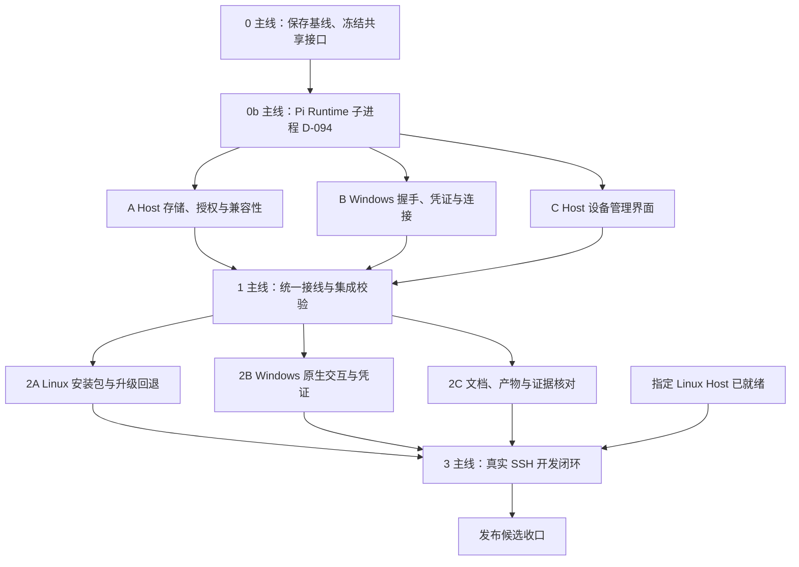

# 2026-09-28 项目重启与并行实施计划

> 状态：计划已整理，实施尚未开始。
> 工作目录：`/mnt/d/Projects/pi-gui-next`。
> 组织方式：主线统筹 + 3 个并行任务；下表为同一 R12 工作项的分工，不同时启动多个产品 Slice。

## 目标与范围

先保存并整理当前开发基线，再完成 R12 多设备配对的工程接入和本地验收。Linux Host 准备好后，完成真实 Windows → SSH → Linux 开发闭环及发布验收。

R12 的产品范围沿用[远程开发计划](remote-development-plan.md)：最多 8 台设备保留配对，轮流连接同一个 Host；同一时刻只有一个远程控制连接。Host 是唯一工作区事实源，普通断开保留配对，客户端取消配对只撤销自身。Web Remote 保留独立的单设备语义。

本轮不扩展同时多端编辑、云中继、手机通知、跨主机会话交接、Windows 原生 Pi 或 P3 生态管理，也不继续大范围结构拆分。前端沿用[现有规范](frontend-guidelines.md)。

## 已核实的起点

| 项目 | 2026-09-28 核对结果 | 对实施的影响 |
| --- | --- | --- |
| Git | 分支 `codex/windows-sync-20260910`；HEAD `7993b8d`，日期 2026-09-11；本次计划编辑前有 105 个已跟踪变更、118 个未跟踪文件，另有既有暂存内容 | 不能从 HEAD 直接派生任务并假定已包含后续工作；先保全整个工作快照及暂存边界 |
| 源码与构建 | 当前源码摘要 `2b34792cb47516ab63195835de790d401d425f5c8de2377d2b4c339e24f237cc` 与 `out/main/build-identity.json` 的源码摘要相同 | 只证明清单记录对应此源码；不代表所有产物已重新核验、安装包已更新或已发布 |
| 最近完整回归 | R12 存储阶段 1,500 项，1,494 通过、6 跳过、0 失败；对应源码 `51ea3d5dd7ce6b5a6bed89bc1079098747fcfd10a6339af1782c927a870f3a8f` | 当前源码已经变化，不能继承整套通过结论 |
| 最新兼容性补丁 | 34 项定向检查通过；完整日志没有结束汇总 | 先核清未收尾状态；不把缺失结论认定为通过或产品失败 |
| R12 接入 | 新设备集合与兼容性检查已有实现；Main/Gateway 仍使用旧单设备存储，Desktop 协议为 2 | 迁移、协议、客户端、管理界面需要作为同一候选接通 |
| 工具链 | 当前 shell 是 Node 22.22.2；`/home/vvv/.local/share/pi-gui-next-wsl/node/bin/node` 已核实为 26.4.0 | 使用项目锁定的 Node 26.4.0 / pnpm 11.9.0，沿用平台隔离入口 |
| 外部验收 | 真实 SSH Host 上次尚未准备；WSL 临时归档查看未验，系统通知点击由用户跳过 | 实施时确认 Host 当前条件；通知点击继续记为跳过，不自动重开 |

证据入口：[R12 存储](../release/evidence/desktop-devices-store-20260917/README.md)、[兼容性补丁日志](../release/evidence/desktop-device-compatibility-20260917/)、[R11 安装包](../release/evidence/host-bundle-20260915/README.md)。证据目录被 Git 忽略，不能仅靠提交源码保存它。

## 阶段与依赖

| 任务 | 初始状态 | 依赖 | 交付物 |
| --- | --- | --- | --- |
| 0 基线与接口 | Ready | 无 | 可恢复工作快照、明确的接口与文件归属 |
| 0b Pi Runtime 子进程 | 本地完成，待合并（分支 `codex/pi-runtime-subprocess`，证据 `release/evidence/pi-runtime-subprocess-20260929/`） | 0 完成 | 按 D-094 迁出 Shared Pi Host；按 D-098 删除旧 RPC 链路，并把 `smoke:pi` 改为启动子进程；按 D-099 加入子进程通信上限，并先接入子进程相关日志；提供对应的定向验证证据 |
| A / B / C | 本地完成，待合并（主线依次实施；分支 `codex/r12-multi-device`，证据 `release/evidence/r12-multi-device-20260929/`） | 0、0b 完成 | 三份互不覆盖的实现及必要定向证据 |
| 1 集成 | Pending | A、B、C 完成 | 同一源码候选，Main/preload/Renderer/Host 全部接通 |
| 2A / 2B / 2C | 2A、2C 已完成；2B 自动化部分已完成，人工 Windows 桌面操作待进行（见“第二轮执行记录”） | 1 完成 | 平台与包验证、准确的操作文档和验收差项 |
| 3 真实 SSH | Pending | 2 完成、指定 Host 已就绪 | 同一候选的真实开发闭环与发布证据 |

## 0：主线先完成的串行准备

1. 记录 HEAD、暂存/未暂存差异、未跟踪文件清单及源码摘要；保存可恢复快照，另存本轮需要的被忽略证据与包校验信息。保留原暂存边界，不用清理、重置或整树回退来获得干净目录。
2. 明确当前快照中已有工作与本轮新增工作的边界。若隔离任务需要 Git 基线，在保全原工作区后将审核过的源码快照放入集成分支；原工作区的暂存状态不作为可随意改写的任务输入。分支使用 `codex/` 前缀。
3. 启用正确工具链，使用现有 `scripts/workspace.mjs`。Windows、Linux 的依赖和构建目录分开；同一 `-checks` 目录的校验保持串行，不绕过锁，也不新增一套开发启动器。
4. 核对兼容性补丁的调用链及现存日志，列出实际未验证部分。此时不因缺少完整日志重复跑整套测试；最终集成后集中完成一次必要的完整回归。
5. 冻结下表中的共享接口和行为，写清 DTO、入口、返回值和错误语义后再派发 A/B/C。具体字段可以在此阶段收敛，三条任务不能分别猜测实现。

| 共享边界 | 实施前必须明确的内容 |
| --- | --- |
| 协议与数据版本 | Desktop 协议升级的版本和精确匹配规则；设备文件版本 2 是另一独立概念；旧客户端明确拒绝，不以静默降级维持连接 |
| 无凭证身份核对 | 固定公开配对身份的核对请求与响应；验证版本/构建及本设备身份后才发送凭证；复用现有 `desktop-device-binding.ts`，凭证及认证哈希不进入 Renderer |
| 设备列表与撤销 | Host 管理列表只返回公开标识、已有名称及必要时间/控制状态；逐台撤销用公开标识，Host 内部定位记录；Web 单设备 DTO 不被改成数组；列出与撤销实现为设置页和以后命令行共用的函数（D-095） |
| 控制连接归属 | 同时绑定设备与 controller；已占用、撤销、过期、旧连接请求有明确结果；配对第二台设备不得踢掉第一台控制连接 |
| 取消配对 | Windows 客户端仅取消自身；结果未确认时沿用现有明确错误和凭证保留语义，不删除其他 Host 的凭证 |
| 管理权限 | 设备列表及逐台撤销沿用 Linux Host 本地管理入口；SSH 客户端不因此获得管理其他设备的权限 |
| 文件格式兼容 | 迁移前已接入启动/部署/回退检查；只有实际运行读取链支持版本 2 后，才更新包中的能力声明 |

### 阶段 0 执行记录（2026-09-29）

| 步骤 | 结果 |
| --- | --- |
| 1 快照 | 原工作区已由提交 `9714b8a` 保存并推送到 `origin/wip/local-snapshot-20260929`，原暂存内容已包含在内。当前基线为 `68afede`，工作区干净，源码摘要 `baf8d381fa2d94f2a0c51431889c6a0ea9cc5f8d44eb18c528dffd9682f0ffc3`。被 Git 忽略的 `release/evidence/` 已打包，连同安装包校验值一起保存在 `~/.local/share/pi-gui-next-baselines/20260929-stage0/`；R11 Host 包和 09-28 WSL 安装包的 `.sha256` 核对通过 |
| 2 工作边界 | `68afede` 之前的内容都属于既有工作；0b 和 R12 的改动从这里开始 |
| 3 工具链 | Linux：Node 26.4.0、pnpm 11.9.0、Git 2.43.0，`workspace.mjs doctor` 全部通过。Windows 侧需要用 Windows Node 另行检查 |
| 4 兼容性补丁 | 调用链已核对：`check`、`start`、`deploy`（复制前、复制后、切换前）和 `rollback` 都会经过 `inspectDesktopHost`，进而调用 `assertDesktopHostDeviceStoreCompatible`。定向测试 34 项全部通过。**尚未验证：**完整核心回归的日志在 761 行通过、零失败后中断，没有最后的汇总；类型检查日志没有记录退出状态。此后源码又有较大变化，按本计划不单独重跑，统一在集成后的完整回归中覆盖 |
| 5 共享接口冻结 | 已冻结：[R12 共享接口](r12-shared-interfaces.md)（2026-09-29 用户确认；设备名称采用 Windows 计算机名；A/B/C 由主线依次实施） |

**阶段完成标准：** 三个任务能从同一源码快照、同一接口说明开始；共享文件仅有一个写入者；接口层临时不完整的中间状态不用于构建发布或真实验收。

## 第一轮：三个并行任务

| 分工 | 实施内容 | 唯一写入范围 | 完成标准 |
| --- | --- | --- | --- |
| **A：Host 端** | 收尾数据兼容检查；Gateway 使用多设备集合；逐设备认证/撤销；设备与 controller 绑定；保留单控制连接 | `src/main/remote/desktop-device-store.ts`、`desktop-host-data-compatibility.ts`、`desktop-host-gateway.ts`、`desktop-host-launch.ts`、`desktop-host-deployment.ts`、`desktop-host-runtime-package.ts` 及对应现有测试 | 两台设备分别配对并重启后保留；第二次配对不替换第一台；撤销非活动设备不影响活动连接，撤销活动设备使其控制请求失效；不兼容版本不能被选中启动或回退 |
| **B：Windows 客户端** | 按冻结协议核对自己的配对身份；衔接凭证恢复、连接占用、断线与撤销；维持多 Host 独立凭证 | `src/main/remote/desktop-host-client.ts`、`windows-remote-session.ts`、`windows-remote-host-manager.ts`、`desktop-device-credential-store.ts`、`desktop-host-preflight.ts` 及对应现有测试 | 身份核对前不发送凭证；普通断开后可恢复；自身取消配对不影响另一设备/Host；占用和撤销不会进入无效重连；旧响应不恢复失效连接，不重放写操作 |
| **C：设备管理界面** | Linux Host 设置页展示设备列表、配对入口与逐台撤销；Windows 展示真实占用/撤销错误和自身取消配对状态 | `src/renderer/src/features/settings/DesktopHostAccessPanel.tsx`、`remote-access-panel.css`；`src/renderer/src/features/desktop-client/ConnectHostPanel.tsx`、`HostConnectionActions.tsx` 及其现有局部样式/相关 fixture | 操作绑定选中设备，等待/错误留在原处；取消确认不撤销；重复点击与迟到结果不误操作；键盘、焦点和窄窗口可用；只消费冻结 DTO，不在界面猜测 Host 状态 |

补充约束：

- A 不顺手改 Web Remote 的单设备模型；确需修改共用私有文件入口，由主线确认影响范围后明确转交 owner。
- B 不改 Renderer，C 不改传输、凭证和后端；UI 在后端尚未接入时可用现有测试 fixture 开发，不能把 fixture 接入生产作为完成状态。
- C 沿用当前设置入口、共享控件与前端规范。列表最多 8 项，不增加虚拟化、通用设备管理框架或独立设计系统。与 Web 共用的 CSS 只做有作用域的修改。
- 所有任务只修本范围内的问题；新增共享文件或跨 owner 变更先由主线重新分配。完成后交付变更清单、接口使用情况、实际验证及未覆盖项，避免只有“已完成”的结论。

## 主线的独占文件与集成职责

主线拥有 `src/shared/desktop-host-contract.ts`、`desktop-client-contract.ts`、`remote-admin-contract.ts`、`src/main/remote/desktop-device-binding.ts`，以及 `src/main/index.ts`、`src/preload/index.ts`、Renderer 的 `App.tsx` / `Workbench.tsx` / `SettingsPanel.tsx` / `global.d.ts` / preview 接线、`package.json`、构建配置和计划文档。三条任务不得同时修改这些文件。

主线先冻结 shared contract，再将 A/B/C 的实际调用接入 Main、IPC 校验、preload 和 Settings。只有设备存储正式接通后，才更新 `desktopHost.deviceStoreVersions`；同步处理旧协议的拒绝行为和所有受影响调用点，不保留两套生产控制链。

阶段 1 在停止写入的集成快照上执行必要的类型检查、生产构建和完整核心回归。冻结期间发现问题，交回原 owner 修复，再按影响范围补验；源码变化后旧报告不直接继承为新候选报告。

执行并行时默认同一工作树按文件归属分工；只有确需隔离时才由主线准备托管 worktree，并确保其包含上述快照。每个任务的命令显式设置自己的工作目录。共享工作树内由主线串行安排校验，worker 不同时占用同一平台的检查目录；采用不同工作目录时才可并行校验。正式构建只由主线执行。

## 第二轮：复用三个任务槽做收口

| 分工 | 范围 | 边界与交付 |
| --- | --- | --- |
| **2A Linux 包与迁移** | 最终候选的 Host 安装、旧配对迁移、同版复用、升级和回退检查 | 使用临时安装目录和真实 Electron Host；确认旧凭证不丢失、升级可用、不兼容回退被拒绝；沿用现有安装入口，不编写第二套发布器 |
| **2B Windows 原生路径** | 原生 Credential Manager、客户端重开、设备界面和撤销；补 WSL 归档临时查看 | 使用隔离应用数据。Windows 桌面交互由一个 owner 串行进行；系统通知点击保持“用户跳过”；模拟事件只作为局部回归证据 |
| **2C 文档与只读核对** | README 当前阶段、Host 操作说明、开发计划、产物/源码身份和未验收项 | 此时主线转交明确的文档写入权；核对源码能力、实际包、已安装版本和真实验收四者，交付差异与准确使用步骤，不重复运行整套测试 |

第二轮冻结生产源码。发现缺陷时暂停受影响的验收，回到原 owner 修复，并为变化后的候选重新生成对应产物和证据。Linux 临时显示与 Windows 桌面可独立验证；涉及同一 Windows 桌面或同一 Host 控制连接的操作必须串行。

### 第二轮执行记录（2026-09-29）

**2A 已完成**：见 `release/evidence/r12-upgrade-20260929/`（worktree）。候选包 `pi-gui-host-linux-x64-20260929-r12.tar.gz` 放在 worktree 的 `release/`，源码摘要 `a48ac1b…`，SHA-256 `592976…72a5`。

**2C 核对结果**（只读，未重跑测试）：

| 对象 | 实际版本 | 与当前源码的关系 |
| --- | --- | --- |
| 当前源码 `wip/local-snapshot-20260929` | 含 D-094 子进程、R12（协议 3）；最近完整回归与构建见 R12 证据 | 基准 |
| R12 候选包 B | 源码摘要 `a48ac1b…`（`5c5e267`；其后仅文档提交） | 与当前源码一致 |
| 本机已安装 WSL 后端 `current` | 09-28 发行版，源码摘要 `378f9f6…`（基于 `7993b8d` 的工作区） | 不含 D-094 与 R12，Desktop 协议为 2 |
| 本机 Windows 安装包 | `pi-gui-next-0.0.1-wsl.20260928-win-x64-setup.exe`（09-28）及 R11 前的 `0.0.1-win-x64-setup.exe` | 协议 2，与 R12 Host 不兼容 |
| 真实验收 | 本地自动化与 Linux 包升级已通过 | Windows 原生（2B）与真实 SSH（第三轮）未进行 |

已修正的文档差异：README 当前阶段、开发计划表头与进展日志、Host 设备记录说明、架构中的 R12 边界。

**要在两台机器上使用 R12，必须同时满足**：Linux Host 用 R12 包（或同一源码构建）经 `install.sh` 升级，首次启动会迁移配对文件且此后不能回退到 R11；Windows 客户端从同一源码重新构建并安装。任一端仍是 09-28 或更早的版本时，匿名握手即报协议不兼容，凭证不会发送。

**2B 自动化部分已完成**：核对时误以为 Windows 缺少 Node 26.4.0；实际 fnm 已安装 Node 26.4.0 与 pnpm 11.9.0，此前找不到是因为从 WSL 调用的 Windows 进程缺少 `PATHEXT`。在 Windows 上用干净克隆运行 `test-platform`（含 Chrome 界面测试），`70c9bd8` 连续两次 151 项 140 通过、0 失败、11 项 Linux 专属跳过；Credential Manager 原生测试与 R12 客户端测试均实际运行通过。首轮暴露的测试辅助代码 `EBUSY` 已由 `54e2a22` 修复。证据见 `release/evidence/r12-windows-2b-20260929/`（worktree）。剩余需人工在 Windows 桌面进行：安装当前源码构建的客户端后的重开、设备名称、被占用提示与取消配对，以及 WSL 归档临时查看。

## 第三轮：真实 SSH 验收与发布收口

启动条件是指定 Linux Host 可访问、具备图形会话、明确 SSH alias/认证方式及隔离测试目录，并准备同一源码候选的 Windows/Linux 产物。准备信息在实施阶段尽早确认；Host 未就绪时，前两轮继续，最终记录为“本地工程完成，真实 SSH 待验”。

在同一真实链路中依次验证：

1. Host 安装、启动与配对；第二设备配对后第一设备记录仍保留；连接占用与轮流接入符合单控制连接规则。
2. Windows 选择远程项目 → 发真实任务 → 处理 Ask/扩展交互 → 上传附件 → 审阅 diff → 暂存与普通提交。
3. 断网恢复、Host 重启、客户端关闭重开；不重放未确认写操作，旧会话或旧连接命令被拒绝。
4. 分别撤销非活动设备与活动设备；核对另一设备保留、被撤销设备无法继续授权；核对版本不匹配与升级/回退边界。

只有以上取得实际证据后，才关闭对应 P4-3/R2/R11 真实主机验收项。P4-4 的临时查看与被跳过通知点击继续逐项记录，不因 SSH 或 R12 完成而自动变成通过。最终安装包以明确候选生成；既有约 201 MiB 的 R11 包不冒充本轮 R12 包。

## 验证投入与完成口径

- 本次仅新增计划与入口链接，只检查文档差异，不跑测试、构建或启动应用。
- 实施时优先复用现有定向检查；仅在配对身份、凭证发送、迁移/撤销、控制权或关键交互缺少必要覆盖时补回归。不上新测试框架，不为可逆文案/布局修改增加脚本，不写只复述实现的测试。
- 三个 worker 不各跑全库。主线在集成后按发布要求跑一次完整 Linux 核心回归、类型检查和 Desktop/Web 构建；Windows 运行必要的既有平台检查。全部通过后，只有新修改、失败或未解决问题才触发扩大或重复验证。
- 原生 Windows、真实 SSH、发布包验证分开记结果；每份证据关联确切源码/产物摘要、通过项、跳过项和未覆盖边界。
- 验收缺项明确保留，不靠扩大测试数量、静默 fallback 或额外重试包装成完成。

## R12 之后：后端结构调整

R12 收口之后，作为独立的一轮实施。这一轮不属于本计划的完成口径，开始前另行细化任务和文件归属。

| 工作 | 决策 | 要点 |
| --- | --- | --- |
| Host 代码与桌面外壳分离、纯 Node Host | D-095 | 拆分 `index.ts`；SSH Host 和 WSL 后端改用 Node 启动；增加 `pair`/`devices`/`revoke` 命令；数据目录保持兼容；按 D-099 加数据目录锁 |
| 网关核心与命令表 | D-097 | 合并两个 HTTP 网关的共用部分；用一张命令表替代三处接线；线上协议前后对比一致 |
| Kernel/Git 拆分与行数检查 | D-098 | 公开方法不变，现有测试原样通过；行数检查脚本在拆分后启用 |
| 日志扩展 | D-099 | 扩展到网关、Host 和 WSL 后端 |

D-095 完成后，第三轮中“Host 需具备图形会话”和“真实 Electron Host”这两条验收前提，需要按新的启动方式重新说明。

### 细化（2026-09-29，用户选择先做本轮）

分支 `codex/backend-restructure`，由主线串行实施；每一步都保持对外行为不变，完成后跑受影响测试并单独提交，整轮结束再跑完整回归与构建。

| 顺序 | 内容 | 文件范围 | 完成标准 |
| --- | --- | --- | --- |
| 1 | Kernel 拆分（D-098）：先把类外的类型与纯函数原样移出，再逐个领域抽成拥有自身状态、通过窄接口访问 Kernel 的协作模块 | `src/main/kernel/` | `WorkbenchKernel` 公开方法、事件与错误不变；Kernel 测试原样通过 |
| 2 | Git 拆分（D-098） | `src/main/git/` | `GitService` 公开方法不变；Git 测试原样通过 |
| 3 | 网关核心与命令表（D-097） | `src/main/remote/`、`src/main/index.ts` 中的接线 | 线上协议前后一致；两个网关与 R12 测试原样通过；新增入口权限对照测试 |
| 4 | Host 组装与桌面外壳分离、纯 Node Host、命令行配对、数据目录锁（D-095、D-099） | `src/main/index.ts` 拆出的新模块、启动器、WSL 启动脚本、打包清单 | 本机桌面行为不变；Node Host 在无显示环境启动并通过握手；数据目录被占用时明确失败 |
| 5 | 日志扩展（D-099）与行数检查脚本（D-098） | 网关、Host、WSL 后端；`scripts/` | 日志不含对话内容与凭证；脚本在拆分后的基线上通过 |

进度（2026-09-30，分支 `codex/backend-restructure`）：

- **1 Kernel 拆分完成**：`workbench-kernel.ts` 6433 → 4251 行。移出类外常量与类型（`workbench-kernel-types.ts`）、纯函数（`workbench-kernel-helpers.ts`），以及 6 个领域：工具图片缓存（`tool-image-cache.ts`）、自动休眠（`runtime-hibernation.ts`）、静态会话预览（`session-previews.ts`）、压缩生命周期（`context-compaction.ts`）、Ask 与 Extension 对话（`context-interactions.ts`）、自动命名（`session-naming.ts`）。启动、fork、临时会话提交、重启恢复与状态发布共用 Kernel 的核心可变状态（上下文集合、前台上下文、指针注册表、启动闸门），拆出只会把这些状态原样暴露给新模块，本轮保留在 Kernel 内。61 个公开方法签名与拆分前一致；Kernel 与 Desktop Host 测试 412/412。
- **2 Git 拆分完成**：`git-service.ts` 4352 → 1081 行。类外声明移入 `git-service-types.ts`、`git-admission.ts`、`git-parsing.ts`、`git-worktree-io.ts`；类方法按领域移入 `GitWorktreeContent`、`GitCommits`、`GitHistory`、`GitBranchSync`，它们只通过 `GitServiceCore`（`git-service-core.ts`）使用共享操作。公开方法签名与拆分前一致；Git 测试 114/114。新文件均不超过 800 行。

**本轮可先交付的结果：** 可恢复且可追溯的开发基线、完成接线的 R12 本地候选、可用的 Host 包与客户端，以及准确的真实 SSH 待验清单。正式跨平台交付以第三轮实际通过为准。
